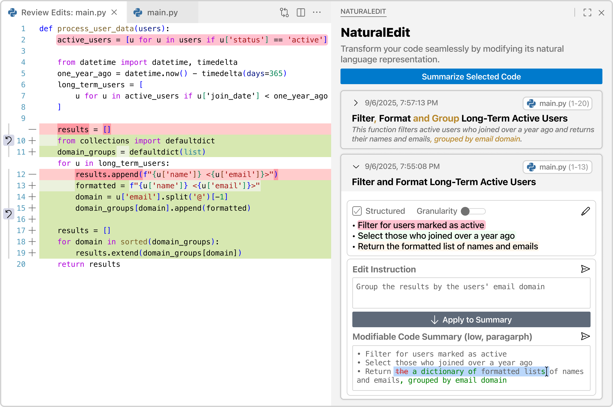

# NaturalEdit

NaturalEdit turns natural language code summaries into a first-class interactive representation — tightly linked to your source code and bidirectionally synchronized with every edit. For detailed information, read our [paper](https://arxiv.org/abs/2510.04494).

## Features

**Adaptive Code Summaries**

Select any code region and generate a natural language summary. Adjust the view on the fly:
- **Structure**: toggle between paragraph and bulleted list
- **Granularity**: switch between a high-level overview, a procedural summary, or a line-by-line explanation

**Interactive NL–Code Mapping**

Hover over any sentence or bullet in the summary to highlight the corresponding code block. Click to navigate directly to that scope.

**Intent-Driven Editing**

Instead of editing code or the summary manually, describe what you want in plain language. NaturalEdit will:
1. Propose a summary diff showing exactly how it interprets your intent
2. Let you review and refine before anything is changed
3. Generate the code change once you approve
4. Auto-update the summary with an incremental diff so you can validate the result

## Usage

1. Select a code region in the editor
2. Click **Summarize Selected Code** in the NaturalEdit panel
3. Use the structure toggle and granularity slider to explore the summary
4. Hover summary segments to trace them to code
5. Type an instruction and click **Apply to Summary**
6. Review the proposed NL diff → approve → inspect the synchronized code diff

## Requirements

- VS Code 1.89.0 or higher (compatible with Cursor and other VS Code forks)
- OpenAI API key with access to `gpt-4.1`

## Known Issues

- Summary generation depends on LLM response time and may feel slow on large code blocks
- At high granularity, summary diffs can be verbose — the most important changes may require careful reading

## Release Notes

### 1.0.0

Initial release.
- Adaptive multi-faceted code summaries
- Interactive NL–code mapping with AST-based structural alignment
- Intent-driven bidirectional synchronization with incremental diffs